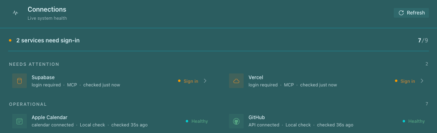

# Connections for Hermes Desktop

A standalone Connections page and status chip for configured messaging platforms, MCP servers, and optional local service checks. Developed for Joey with AI assistance. Licensed under MIT.



*Cropped live view of the standalone plugin on a local SDK-enabled Desktop build. Additional service rows and surrounding app UI are outside the crop; displayed statuses are a snapshot, not a compatibility guarantee.*

## Compatibility

Requires Hermes Desktop with the proposed [`connections.health` SDK contribution API (PR #105196)](https://github.com/NousResearch/hermes-agent/pull/105196), plus the passive `mcp.servers.status` RPC merged in [#104527](https://github.com/NousResearch/hermes-agent/pull/104527). The SDK follow-up is not merged: stock Hermes releases without those SDK exports cannot load this plugin. This is a source distribution, not an npm package; no JavaScript build is needed at runtime.

## Installation

Use an explicitly chosen `HERMES_HOME` for the backend profile. Copy `plugin.yaml`, `__init__.py`, `desktop/plugin.js`, `dashboard/manifest.json`, and `dashboard/plugin_api.py` into its `plugins/connections/` directory, retaining the directory layout. Enable `connections` in the existing `plugins.enabled` configuration list without replacing other entries, and enable the Desktop plugin in Settings → Plugins. Back up existing files first. Desktop watches plugin files and may load a save immediately; coordinate any backend restart yourself.

The unified package supplies both the Desktop entry point and `/api/plugins/connections` backend namespace. No model tools are registered. Do not install a second copy under `desktop-plugins/connections`.

Read [PRIVACY.md](PRIVACY.md) before enabling. Optional services need their own existing authentication; this plugin does not install them or perform login.

## Checks

Runtime imports only Hermes SDK/React and the Hermes Python environment (FastAPI plus stdlib). Tests intentionally use the real SDK resolver, not a replacement mock. In a separate Hermes source checkout with the proposed SDK, install its root/desktop workspace dependencies according to its contributing guide. Expose that checkout's dependency tree as this project's local, ignored `node_modules`, then run:

```sh
HERMES_SOURCE=/path/to/hermes NODE_ENV=test npm test
npm run check:syntax
PYTHONDONTWRITEBYTECODE=1 /path/to/hermes-python -m unittest discover -s dashboard -p 'test_*.py' -v
```

Tests use synthetic service data and block real HTTP/subprocess calls. These checks are not Electron GUI or remote-profile acceptance. The test harness is coupled to the selected Hermes source checkout; it deliberately has no independently resolved npm dependency set.

## Behavior and limits

MCP inventory reads are passive. Manual refresh performs active MCP tests with bounded retry. Authoritative connected/failed runtime observations take precedence over cached manual checks. Optional local API checks are active when the page/status chip loads and periodically thereafter; see privacy details. Service credentials and local command availability belong to the backend host, not necessarily the Desktop client. Health timestamps are observations, not proof that every feature works.
